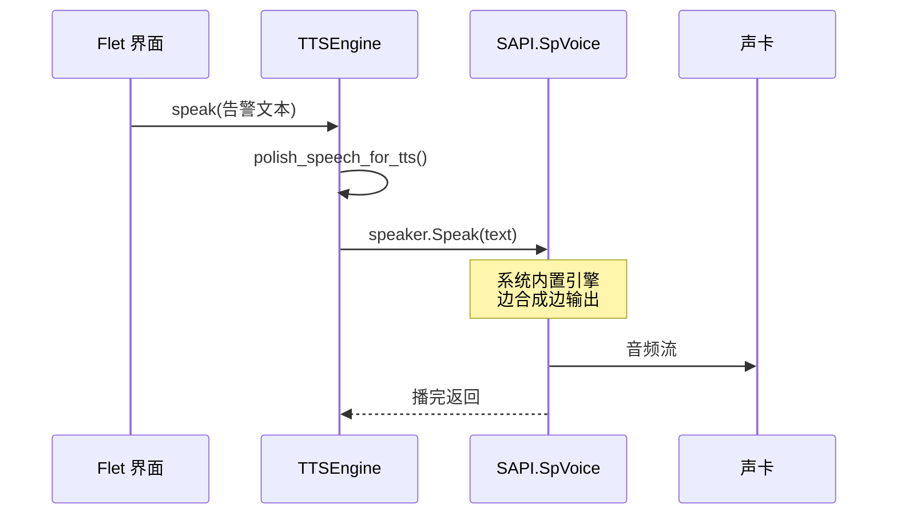
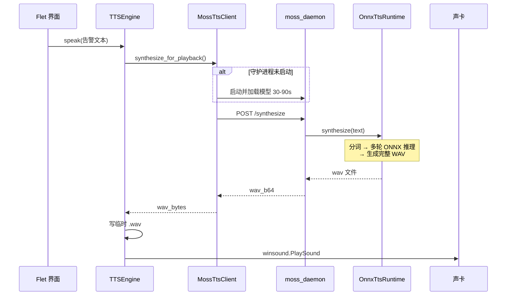

# Windows SAPI 离线 vs MOSS 本地 — 语音生成速度对比

> 文档版本：2026-06-29  
> 适用场景：理解告警视听助手中两种本地 TTS 引擎为何体感速度差异巨大  
> 相关代码：`tts_engine.py`、`moss_tts.py`、`moss_daemon.py`

---

## 一、结论先行

| 维度 | Windows SAPI 离线 | MOSS 本地 |
|------|-------------------|-----------|
| **典型首字延迟** | 约 **0.1–0.5 秒** | 首次 **30–90 秒**（冷启动加载模型）；就绪后 **1–8 秒** |
| **一句告警话术**（如 `B05柜，NE20E杠1，端口，联通`） | 通常 **< 1 秒** 开始出声 | 守护进程就绪后约 **2–15 秒** 才播完 |
| **技术本质** | 操作系统内置拼接/参数语音 | 100M 参数神经网络 + 多 ONNX 模型推理 |
| **音质** | 机械感较强，但稳定 | 更自然，接近真人 |
| **适用场景** | 告警要快、要稳、零配置 | 对音质有要求、可接受等待 |

**为什么 SAPI 快这么多？** 不是因为 Python 写得更好，而是：

1. SAPI 用的是 **Windows 已预装好的语音引擎**，应用只发一句 `Speak(文本)`，系统边算边播。
2. MOSS 每次（或首次）要走 **深度学习推理流水线**：分词 → 多轮 ONNX 推理 → 生成完整 WAV → 再播放，计算量大几个数量级。

---

## 二、在本项目中的调用路径

两种引擎都经由 `TTSEngine` 统一调度，但底层实现完全不同。

```
用户点击「测试语音」或轮询产生告警
        │
        ▼
   tts_engine.TTSEngine._run()   （后台线程消费队列）
        │
        ├── backend = local  ──► _speak_local()     ──► SAPI 直接出声
        │
        └── backend = moss   ──► _speak_moss()      ──► 先合成 WAV 再播放
```

### 2.1 Windows SAPI 路径（快）

**入口**：`tts_engine.py` 中 `BACKEND_LOCAL`（界面显示「Windows SAPI 离线」）。

**初始化（程序启动时做一次）**：

1. 尝试 `win32com.client.Dispatch("SAPI.SpVoice")` 创建语音对象  
2. 从本机已安装语音包中优先选中文（慧慧 / 康康等）  
3. 失败则依次回退 `pyttsx3`、PowerShell `System.Speech.Synthesis`

**每次播报**：

```python
# tts_engine.py — _speak_local()
speaker.Rate = rate          # 语速 -10 ~ 10
speaker.Speak(text)          # 同步调用：系统边合成边输出到声卡
```

特点：

- **不生成中间 WAV 文件**（主路径下）
- **不经过 HTTP / 子进程 / Base64**
- **不加载神经网络模型**
- `Speak()` 阻塞直到播完，对短句几乎「说完即播完」

独立测试可用：`python test_sapi_tts.py -t "你好"`

### 2.2 MOSS 路径（慢）

**入口**：`tts_engine.py` 中 `BACKEND_MOSS`（界面显示「MOSS 本地」）。

**每次播报**：

```python
# tts_engine.py — _speak_moss()
wav_bytes = self._moss_client.synthesize_for_playback(text, ...)
self._play_wav_bytes(wav_bytes)   # 写临时 .wav → winsound 播放
```

`synthesize_for_playback` 在 `moss_tts.py` 中实现，优先走 **守护进程**：

```
moss_tts.MossTtsClient
    │
    ├─► _ensure_daemon()          首次：启动 moss_daemon.py，加载 ONNX（30–90s）
    │
    ├─► POST /synthesize          HTTP 提交文本
    │       │
    │       ▼
    │   moss_daemon.py
    │       OnnxTtsRuntime.synthesize()
    │           文本规范化 → 分块 → 逐帧 generate_audio_frames
    │           → codec 解码 → 写临时 WAV → Base64 返回
    │
    └─► base64 解码 → 返回 wav_bytes → _play_wav_bytes()
```

守护进程设计目的见 `moss_daemon.py` 文件头注释：**模型只加载一次**，避免「每次试听都冷启动」——但单次合成本身仍然比 SAPI 慢一个数量级以上。

独立测试可用：`.\alarm_env\Scripts\python.exe test_moss_tts.py`

---

## 三、Windows SAPI 为什么快 — 原理拆解

### 3.1 技术栈

| 层级 | 内容 |
|------|------|
| API | Microsoft Speech API（SAPI 5.x） |
| 本项目绑定 | `pywin32` → `SAPI.SpVoice` COM 组件 |
| 语音数据 | 系统已安装的 `.dat` 语音包（如 Microsoft Huihui Desktop） |
| 运行位置 | Windows 系统服务 / 本地 DLL，C/C++ 原生实现 |

### 3.2 工作方式（概念）

```
文本 ──► 前端分析（分词/注音）──► 声学模型（轻量）──► 音频流 ──► 声卡
                              ↑
                    模型已在系统内存，无需应用加载
```

SAPI 属于 **传统 TTS**（单元挑选 / 轻量参数合成），不是大语言模型式逐 token 生成：

- 语音库预先录制或参数化，**不做端到端神经网络推理**
- 短句计算量极小，CPU 占用低
- **流式输出**：不必等整句 WAV 生成完毕才开始播放

### 3.3 本项目的额外开销（极少）

播报前会调用 `alarm_processor.polish_speech_for_tts()` 做话术润色（统一设备名、up/down → 联通/中断），纯字符串处理，耗时可忽略。

---

## 四、MOSS 为什么慢 — 原理拆解

### 4.1 技术栈

| 层级 | 内容 |
|------|------|
| 模型 | MOSS-TTS-Nano-100M（约 1GB ONNX 资产） |
| 推理引擎 | `onnxruntime`（CPU 或 CUDA） |
| 运行环境 | 独立虚拟环境 `moss_env`（与主程序 `alarm_env` 隔离） |
| 源码位置 | `third_party/MOSS-TTS-Nano/onnx_tts_runtime.py` |

### 4.2 模型加载（一次性，但很重）

`moss_daemon.py` 启动时执行 `_load_runtime()`：

```python
_runtime = OnnxTtsRuntime(
    thread_count=cpu_threads,
    execution_provider="cpu" | "cuda",
)
```

需要加载的资源包括（路径在 `third_party/MOSS-TTS-Nano/models/`）：

| 组件 | 大致体积 | 作用 |
|------|----------|------|
| `moss_tts_global_shared.data` | ~441 MB | TTS 主模型权重 |
| `moss_tts_local_shared.data` | ~230 MB | TTS 局部解码 |
| 多个 `.onnx` 图 | 数 MB 级 | prefill / decode step / local decoder |
| Audio Tokenizer 相关 | ~90 MB | 文本 ↔ 音频 token 编解码 |

**首次启动或切换 CPU/GPU** 时，把这些读入内存并初始化 ONNX Session，通常 **30–90 秒**（见 `docs/MOSS语音缓存与拼合方案.md`）。

### 4.3 单次合成流水线（每次都做）

`OnnxTtsRuntime.synthesize()` 核心步骤：

1. **文本准备**：可选 WeTextProcessing 规范化（Windows 上常关闭 `enable_wetext=False`）
2. **SentencePiece 分词** → `text_token_ids`
3. **解析音色**：内置 `Junhao` 预设或参考音频 prompt
4. **长句分块**：超过 `voice_clone_max_text_tokens`（默认 75）会拆多块依次合成
5. **自回归生成音频帧**：`generate_audio_frames()` — 循环调用多个 ONNX 图（prefill → decode step × N）
6. **Codec 解码**：`decode_full_audio_safe` 或流式 `codec_streaming_session`
7. **拼接波形** → 写 WAV 文件 → HTTP 返回 Base64
8. **主程序**：解码字节 → 再写一次临时 WAV → `winsound.PlaySound`

告警典型句式约 15–25 字，仍要走完整推理链，**无法像 SAPI 那样「一个字一个字边算边播」**（当前集成方式为整句合成后再播）。

### 4.4 额外延迟来源（本项目架构）

| 环节 | 说明 |
|------|------|
| 进程间通信 | `alarm_env` → HTTP → `moss_env` 守护进程 |
| 双写 WAV | 守护进程写临时文件 + 主程序再写临时文件 |
| Base64 编解码 | 整段音频在网络环回中膨胀约 33% |
| CPU 默认模式 | 未安装 `fix_moss_gpu.ps1` 时纯 CPU 推理更慢 |
| 非流式播放 | 必须等 `synthesize_for_playback` 返回完整 `wav_bytes` 才开始播 |

---

## 五、并排对比表

| 对比项 | Windows SAPI 离线 | MOSS 本地 |
|--------|-------------------|-----------|
| **引擎类型** | 系统传统 TTS | 神经网络 TTS（100M） |
| **模型位置** | Windows 语音包 | `third_party/.../models/` ~1GB |
| **应用启动成本** | 创建一个 COM 对象（毫秒级） | 可选：首次拉起守护进程 + 加载模型（分钟级） |
| **单次合成计算** | 极低 | 高（多 ONNX 图 + 自回归帧） |
| **输出方式** | 直出声卡（流式） | 整句 WAV → 再播放（批式） |
| **子进程** | 无（win32com 路径） | `moss_daemon.py` 或 `moss-tts-nano` CLI |
| **网络** | 无 | 本地 HTTP 127.0.0.1（环回） |
| **音质** | 一般 | 较好 |
| **离线** | 完全离线 | 完全离线（模型已下载后） |
| **依赖** | Windows + pywin32 | Python 3.10+、`moss_env`、ONNX 模型 |
| **代码文件** | `tts_engine.py` | `moss_tts.py` + `moss_daemon.py` + `onnx_tts_runtime.py` |

---

## 六、流程图

### 6.1 Windows SAPI（本项目）



### 6.2 MOSS（本项目）



---

## 七、典型耗时参考（量级）

> 实际数值与 CPU、是否 GPU、句长有关，以下为运维桌面环境经验区间。

| 场景 | Windows SAPI | MOSS（守护进程已就绪） | MOSS（冷启动） |
|------|--------------|------------------------|----------------|
| 「你好」2 字 | < 0.5 s | 2–5 s | +30–90 s 加载 |
| 端口告警一句 ~20 字 | 0.5–1.5 s | 3–10 s | +30–90 s 加载 |
| 较长恢复话术 ~40 字 | 1–3 s | 8–15 s | +30–90 s 加载 |

项目内已有更细的 MOSS 优化讨论，见 [MOSS语音缓存与拼合方案](./MOSS语音缓存与拼合方案.md) 第一节。

---

## 八、选型建议

### 8.1 优先用 Windows SAPI 的场景

- 告警 **时效性第一**，需要「来了就播」
- 机房电脑 **无独显** 或未配置 MOSS GPU
- 不想维护 `moss_env`、模型下载与守护进程
- 能接受机械感语音

### 8.2 优先用 MOSS 的场景

- 对 **音质、自然度** 有要求（演示、录音留存）
- 机器有 **NVIDIA GPU** 且已运行 `fix_moss_gpu.ps1`
- 可接受首次加载等待，或长期开着应用保持守护进程常驻
- 愿意配合后续 **片段缓存 / 拼合播放** 方案降延迟

### 8.3 本项目默认策略

`tts_config.default_backend_mode()`：若配置了讯飞密钥则默认在线讯飞，否则默认本地引擎。  
界面可随时在下拉框切换，**试听 SAPI** 按钮始终强制走 SAPI，不受当前引擎选择影响。

---

## 九、如何让 MOSS 接近 SAPI 的响应速度？

SAPI 的「快」来自架构代差，MOSS **很难在整句实时合成上完全追平**，但可以把运维体感拉近：

| 手段 | 状态 | 说明 |
|------|------|------|
| `moss_daemon.py` 守护进程 | **已实现** | 消除重复加载模型 |
| 应用启动后预热守护进程 | 可手动 / 待产品化 | 轮询前模型已就绪 |
| `fix_moss_gpu.ps1` GPU 加速 | 可选安装 | 合成耗时 often 减半 |
| 调高 CPU 线程（界面「MOSS 加速」） | **已实现** | 纯 CPU 时有效 |
| 固定词 / 设备名片段缓存 + 拼合 | 方案已写 | 见 [MOSS语音缓存与拼合方案](./MOSS语音缓存与拼合方案.md) |
| 流式边合成边播 | MOSS 运行时支持 streaming 参数 | 本项目当前未接入 UI 播放链 |

告警句式高度模板化（`{机柜}，{设备}，端口，{状态}`），**片段缓存** 是最有性价比的 MOSS 加速方向：播放时 0 次推理，仅拼接已有 WAV，延迟可降到 **< 500 ms**。

---

## 十、相关文件索引

| 文件 | 职责 |
|------|------|
| `tts_engine.py` | 三引擎统一入口；SAPI `Speak` vs MOSS `synthesize_for_playback` |
| `tts_config.py` | MOSS 路径、守护进程端口、CPU/GPU 配置 |
| `moss_tts.py` | 守护进程生命周期、HTTP 合成、CLI 回退 |
| `moss_daemon.py` | FastAPI 服务；模型单次加载 |
| `third_party/MOSS-TTS-Nano/onnx_tts_runtime.py` | ONNX 推理与 WAV 生成 |
| `test_sapi_tts.py` | 单独压测 / 试听 SAPI |
| `test_moss_tts.py` | 单独压测 / 试听 MOSS |
| `docs/MOSS语音缓存与拼合方案.md` | MOSS 后续性能优化设计 |

---

## 十一、自测命令

在项目根目录执行，可直观感受速度差：

```powershell
# Windows SAPI — 通常秒出
.\alarm_env\Scripts\python.exe test_sapi_tts.py -t "B05柜，NE20E杠1，端口，联通"

# MOSS — 首次含守护进程加载；第二次会快一些
.\alarm_env\Scripts\python.exe test_moss_tts.py -t "B05柜，NE20E杠1，端口，联通"
```

观察终端输出与出声时间差即可验证本文结论。
